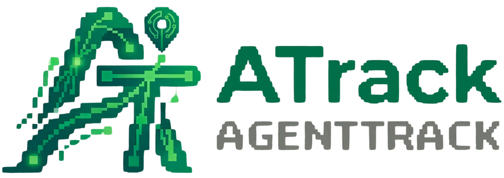

<div align="center">


### ⚡ AI Activity Tracker for the Terminal

[](https://github.com/alfaXphoori/AgentTrack/releases)
[](https://go.dev)
[](LICENSE)
[](#installation)

Track every AI interaction across **Cursor, Copilot, Gemini CLI, Claude Code, Aider** and more — *automatically*.  
Token counts, costs, summaries, and a full TUI dashboard — all directly in your terminal.

[Installation](#-installation) • [Quick Start](#-quick-start) • [Features](#-features) • [Dashboard](#-dashboard) • [Usage](#-usage) • [Integrations](#-ai-agent-integrations)

</div>

---

## ✨ What's New in v0.13.7

| Feature | Description |
|:---|:---|
| ♻️ **Reset / Uninstall** | Added `atrack reset` and `atrack uninstall` with optional `--yes` for non-interactive cleanup. |
| 🧱 **Log Storage Hardening** | Switched to append-friendly JSONL handling with file locking and safer large-entry reads. |
| 📺 **Dashboard Refresh** | Overview, Stats, Trends, and Cost tabs now refresh live without re-entering the dashboard app loop. |
| 🧪 **Test Cleanup** | Test runs now use a temporary `ATRACK_HOME`, avoiding generated artifacts inside the source tree. |
| 🪟 **Windows Packaging** | Added Scoop packaging support alongside the existing release pipeline. |
| 📘 **Docs / UX** | Updated install and command docs to reflect reset, uninstall, and current packaging options. |

---

## 📦 Installation

<details open>
<summary><b>🍺 Homebrew (macOS / Linux) — Recommended</b></summary>

```bash
brew tap alfaXphoori/agenttrack
brew install atrack
```

> Note: This currently requires a published tap repository at `alfaXphoori/homebrew-agenttrack`.

</details>

<details>
<summary><b>💻 macOS / Linux — Build from Source</b></summary>

```bash
git clone https://github.com/alfaXphoori/AgentTrack.git
cd AgentTrack
go build -o atrack ./cmd/atrack
go install ./cmd/atrack
```

</details>

<details>
<summary><b>🐹 macOS / Linux — via Go</b></summary>

```bash
go install github.com/alfaXphoori/AgentTrack/cmd/atrack@latest
```

> Note: This repository is private, so `go install` requires authenticated GitHub access.

</details>

<details>
<summary><b>🐧 Linux — Pre-compiled Binary</b></summary>

Download the latest release from [GitHub Releases](https://github.com/alfaXphoori/AgentTrack/releases):
```bash
tar -xzf AgentTrack_Linux_x86_64.tar.gz
sudo mv atrack /usr/local/bin/
```

</details>

<details>
<summary><b>🍦 Windows — Scoop (Recommended)</b></summary>

```powershell
# one-time: add this bucket
scoop bucket add atrack https://github.com/alfaXphoori/scoop-bucket.git

# install AgentTrack
scoop install atrack

# optional: upgrade/remove later
scoop update atrack
scoop uninstall atrack
```

> Note: This currently requires a published bucket repository at `alfaXphoori/scoop-bucket`.

</details>

<details>
<summary><b>🪟 Windows — PowerShell One-liner (Alternative)</b></summary>

```powershell
go install github.com/alfaXphoori/AgentTrack/cmd/atrack@latest
```
*(Requires [Go](https://go.dev/doc/install) to be installed)*

</details>

<details>
<summary><b>📦 Windows — Manual Binary Install</b></summary>

1. Download `AgentTrack_Windows_x86_64.zip` from [Releases](https://github.com/alfaXphoori/AgentTrack/releases).
2. Extract `atrack.exe` to a folder (e.g., `C:\atrack`).
3. Add that folder to your System **PATH**.

</details>

<details>
<summary><b>💻 Windows — Build from Source</b></summary>

```powershell
git clone https://github.com/alfaXphoori/AgentTrack.git
cd AgentTrack
go build -o atrack.exe ./cmd/atrack
```

</details>

<br>

---

## 🚀 Quick Start

Get up and running in seconds:

```bash
# Initialize rules for all AI agents in your project
atrack init

# Open the TUI dashboard to view your tracking
atrack dashboard
```

---

## 🎯 Features

- 🔄 **Auto-Tracking:** Logs AI questions, answers, models, and token counts seamlessly in the background.
- 📺 **TUI Dashboard:** 7-tab interactive dashboard: *Overview · Logs · Stats · Trends · Cost · Search · Settings*.
- 🔴 **Live Watch:** Real-time log streaming directly inside the dashboard.
- 💰 **Cost Tracking:** Per-model cost estimation via OpenRouter pricing.
- 🔃 **OpenRouter Sync:** Pull the latest model prices with a single command.
- 🔍 **Search & Filter:** Full-text search with date range, model, category, and tag filters.
- 📤 **Export:** Easily export your logs to Markdown, CSV, or JSON formats.
- 🤖 **12+ Integrations:** Supports Cursor, Copilot, Gemini CLI, Claude Code, Aider, and many more.
- 🗓️ **Monthly Log Rotation:** Logs are automatically stored per-month in `~/.atrack/` to keep things tidy.

---

## 📺 Dashboard

Launch the dashboard with `atrack dashboard`. Navigate effortlessly using keys `1`–`7`:

| Key | Tab | Description |
|:---:|:---|:---|
| `1` | **Overview** | Daily / weekly / monthly snapshot + recent activity. |
| `2` | **Logs** | Full log table with filter bar + live watch mode. |
| `3` | **Stats** | ASCII bar chart showing usage by model. |
| `4` | **Trends** | 30-day activity bar chart for quick insights. |
| `5` | **Cost** | Cost summary + detailed per-model cost breakdown. |
| `6` | **Search** | Full-text search with a detailed view panel. |
| `7` | **Settings** | Configuration, export options, and log management. |

---

## 📖 Usage

### 📝 Logging

```bash
# Auto-Logging (AI Q&A)
atrack auto "user question" "AI answer summary" "model_name" tokens_in tokens_out

# Manual Logging
atrack log "Started research on project"
atrack log "Fixed auth bug" -c "Bugfix" -t "auth,security"
```

### 🔍 Viewing & Searching

```bash
# View Logs
atrack list                                       # all logs
atrack list last                                  # most recent
atrack list 2026-05-07                            # by date
atrack list --from 2026-05-01 --to 2026-05-07     # date range
atrack list model "gemini-2.5-pro"                # by model
atrack list category "Bugfix"                     # by category

# Search
atrack search "bug fix"
atrack search tag "export"
atrack search model "gemini-2.5-pro"
atrack search "auth" --from 2026-05-01 --to 2026-05-31
```

### 📊 Analytics & Cost

```bash
# Activity Summary
atrack summary             # today (default)
atrack summary week
atrack summary month

# Stats & Cost
atrack stats               # overall totals
atrack stats today         # today only
atrack stats model         # per-model breakdown
atrack stats cost          # estimated cost per model

# Pricing Sync (OpenRouter)
atrack pricing sync                    # sync models in logs/config
atrack pricing sync gemini-2.5-pro     # sync one model
atrack pricing sync all                # sync every model
```

### 🛠️ Management & Config

```bash
# Edit & Delete
atrack edit 5 "Corrected message"
atrack edit 5 tags "bug,reviewed"
atrack delete 5

# Export
atrack export md
atrack export csv
atrack export json

# Configure
atrack config show
atrack config set display.max_logs_view 25
atrack config set pricing.currency THB
atrack config reset

# Reset / Uninstall
atrack reset                 # interactive reset (delete logs + reset config)
atrack reset --yes           # non-interactive reset
atrack uninstall             # interactive uninstall (remove data/hooks/binary)
atrack uninstall --yes       # non-interactive uninstall
```

---

## 🤖 AI Agent Integrations

Run `atrack init` in any project to auto-generate rule files for all supported agents.

| Agent | Integration |
|:---|:---|
| **Gemini CLI** | [`gemini-cli-atrack.sh`](scripts/gemini-cli-atrack.sh) native watcher or [`gemiatrack.sh`](scripts/gemiatrack.sh) wrapper |
| **GitHub Copilot** | [integrations/copilot.md](integrations/copilot.md) |
| **Cursor IDE** | `.cursorrules` *(auto-generated)* |
| **Cline (VS Code)** | `.clinerules` *(auto-generated)* |
| **Claude Code** | [integrations/claude-code.md](integrations/claude-code.md) |
| **Aider** | [integrations/aider.md](integrations/aider.md) |
| **Roo Code** | [integrations/roo-code.md](integrations/roo-code.md) |
| **Windsurf** | [integrations/windsurf.md](integrations/windsurf.md) |
| **Qwen Code** | [integrations/qwen-code.md](integrations/qwen-code.md) |
| **Codex CLI** | [integrations/codex.md](integrations/codex.md) |
| **Shell-GPT** | [integrations/sgpt.md](integrations/sgpt.md) |
| **Open Interpreter** | [integrations/open-interpreter.md](integrations/open-interpreter.md) |
| **Continue.dev** | [integrations/continue.md](integrations/continue.md) |

---

## 📁 Project Structure

```text
AgentTrack/
├── cmd/atrack/                # Application entrypoint
│   └── main.go
├── internal/app/              # Core logic & TUI components
│   ├── app.go
│   ├── dashboard.go
│   ├── timezones.go
│   └── watchers.go
├── scripts/
│   ├── gemini-cli-atrack.sh   # Gemini CLI background watcher
│   ├── gemiatrack.sh          # Gemini CLI interactive wrapper
│   ├── vscode-copilot-watcher.sh  # VS Code Copilot background watcher
│   ├── cursor-atrack.sh       # Cursor IDE wrapper
│   ├── auto-run-service.sh    # Auto-start service helper
│   └── atrack-base.sh         # Shared utilities
├── agent-rules/               # AI agent rule templates
│   ├── AGENTS.md
│   ├── CLAUDE.md
│   └── QWEN.md
├── integrations/              # Per-agent integration guides
└── ~/.atrack/                 # Data directory (auto-created)
    ├── config.json
    └── atrack_logs_YYYY_MM.json
```

---

## 📄 License

This project is licensed under the **Apache License 2.0**.  
See the [LICENSE](LICENSE) file for the full license text.

Built with ❤️ by [alfaXphoori](https://github.com/alfaXphoori) and the open-source community.

